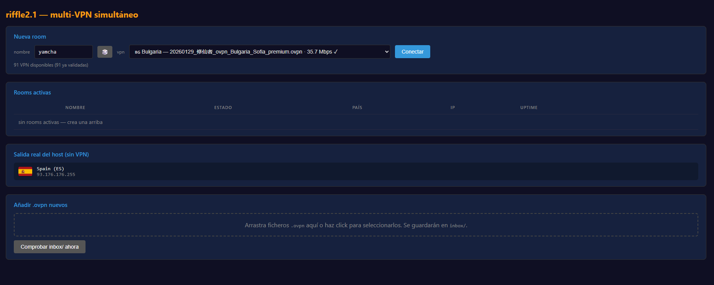
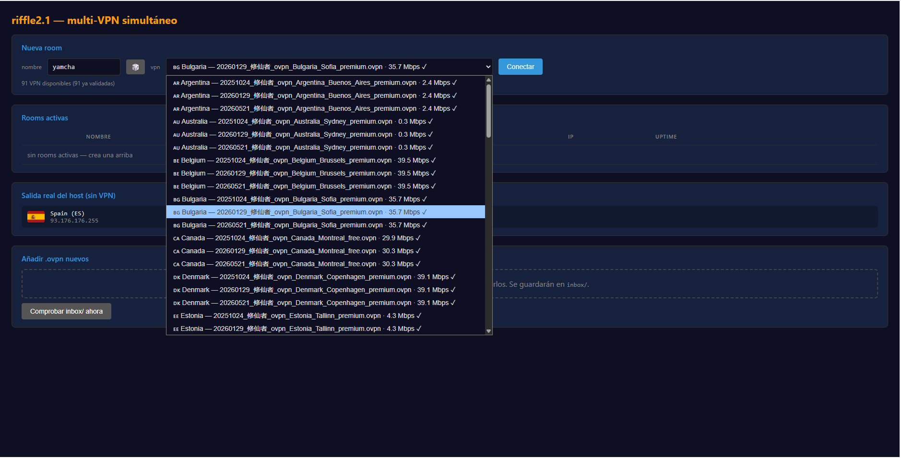
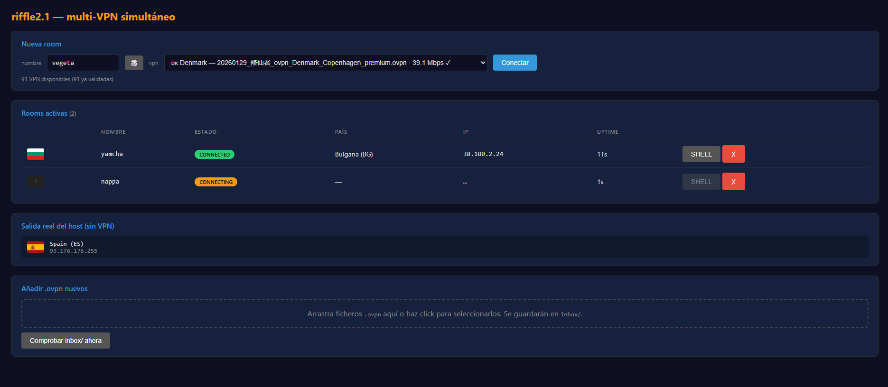
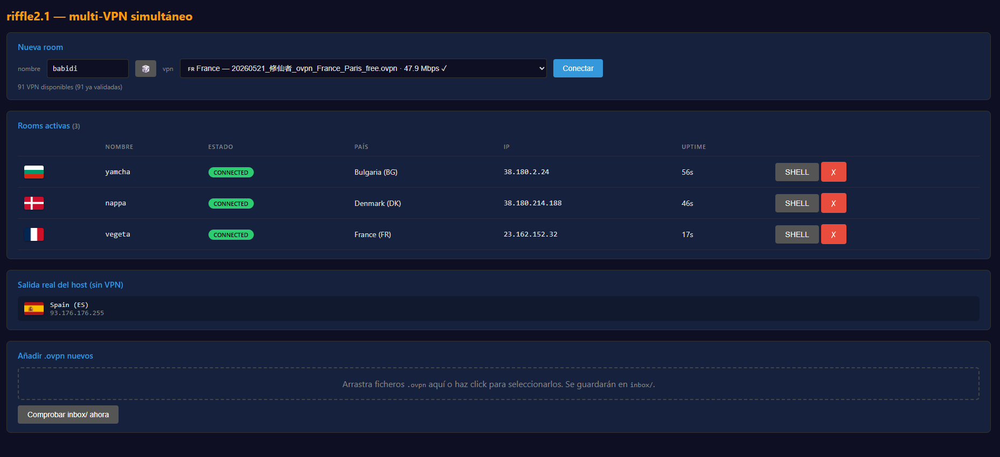
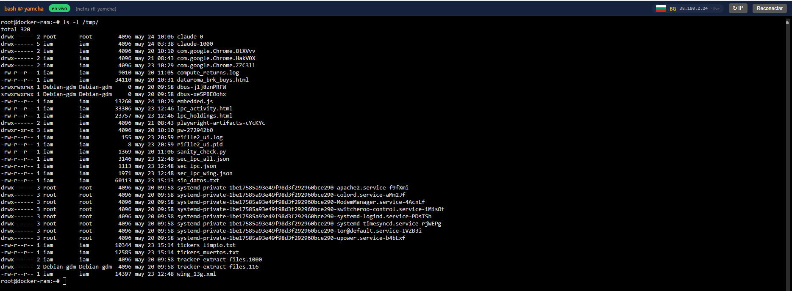

# riffle2 — validador `.ovpn` y multi-VPN simultáneo

Dos herramientas que comparten directorio y cache:

- **`riffle2` (v1)** — validador batch que coge cada `.ovpn`, levanta OpenVPN, comprueba que el túnel enruta de verdad y mide bandwidth. Los muertos van a `trash/`, los buenos a `ok/`.
- **`riffle2.1` (v2)** — UI web que levanta **N conexiones OpenVPN a la vez**, cada una aislada en su propio *network namespace* de Linux. Te da una shell `bash` por país, con su tráfico saliendo por la VPN correspondiente.

## ¿Para qué sirve?

- Curar listas grandes de `.ovpn` gratuitos automáticamente (descarta los muertos, mide velocidad).
- Tener **varias salidas a internet activas en paralelo** (una por país) y trabajar con cada una desde su propia terminal sin que se pisen.

---

## Captura general



Una sola página con cuatro paneles:

1. **Nueva room** — eliges un `.ovpn` validado del desplegable, le pones nombre (rellenado al azar con personajes de Dragon Ball) y conectas.
2. **Rooms activas** — tabla con cada VPN levantada (estado, país, IP, uptime, shell, borrar).
3. **Salida real del host (sin VPN)** — tu IP/país real, refrescado periódicamente.
4. **Añadir .ovpn nuevos** — dropzone para subir ficheros; tras subirlos se lanza la validación automática y verás el log en vivo.

## Dropdown de VPNs



Sólo aparecen los `.ovpn` que han pasado el check (están en `ok/`). Cada uno con bandera del país, nombre, **Mbps medidos** y `✓`. Si no aparece nada, es porque aún no has subido y validado ninguno.

## Múltiples conexiones en paralelo



Cada room vive en su propio netns (`rfl-<nombre>`). En la captura tienes a `yamcha` en Bulgaria (connected, IP `38.180.2.24`) y `nappa` que justo está terminando el handshake.



Tres salidas activas simultáneas: Bulgaria, Dinamarca y Francia. **No usan tablas de rutas a nivel host**, así que no se pelean entre ellas ni con la conexión normal de la máquina.

## Shell por país



Botón `SHELL` en cada row → se abre una terminal `xterm.js` conectada por websocket a un `bash` dentro del netns de esa room. Todo lo que ejecutes dentro (`curl`, `wget`, `nc`, lo que sea) sale por esa VPN. Arriba a la derecha tienes la IP/país en directo para que confirmes de un vistazo que estás en el país correcto.

---

## Requisitos

- Linux con `iptables`, `ip` (iproute2), módulo `tun` cargado (`modprobe tun`).
- `openvpn`, `curl`.
- Python 3.10+ con: `fastapi`, `uvicorn`, `python-multipart`.
- **Root** — `ip netns` e `iptables` lo necesitan.

```bash
sudo apt install openvpn iptables iproute2 curl python3-pip
pip install fastapi uvicorn python-multipart
sudo modprobe tun
```

## Instalación

```bash
git clone https://github.com/mar-i0/riffle2.git
cd riffle2
mkdir -p inbox ok needs_auth trash
```

Pon tus `.ovpn` en `inbox/` (o súbelos por la web).

---

## Uso

### v2.1 — UI multi-VPN

```bash
sudo bash lanzar_riffle21.sh
# o directamente:
sudo python3 riflle21_ui.py
```

Abre `http://localhost:8061/` (o la IP de la máquina). Sube `.ovpn`, espera a que se validen, crea rooms.

Variables opcionales:

```bash
RIFLLE21_HOST=127.0.0.1 RIFLLE21_PORT=9000 sudo python3 riflle21_ui.py
```

Si has matado el proceso con `kill -9` y han quedado `rfl-*` huérfanos:

```bash
sudo python3 riflle21_ui.py --cleanup-orphans
```

### v1 — validador CLI / UI simple

```bash
# Validar todo lo de inbox/ (mueve a ok/ o trash/ según resultado)
sudo python3 riflle2.py check

# Validar + medir bandwidth
sudo python3 riflle2.py --bandwidth check

# Vigilar el inbox en bucle
sudo python3 riflle2.py watch

# Matar todos los openvpn corriendo en la máquina
sudo python3 riflle2.py --kill

# UI web simple (una sola conexión a la vez)
sudo python3 riflle2_ui.py    # puerto 8060
```

Si un `.ovpn` conecta pero no enruta (típico de packs gratuitos sin `redirect-gateway`), `riflle2.py` lo parchea automáticamente añadiendo `redirect-gateway def1` + DNS público.

---

## Arquitectura v2.1

```
   ┌────────────────────────────────────────────────┐
   │  Host (default routing, salida normal)         │
   │                                                │
   │   ┌──────────┐  veth   ┌─────────────────┐    │
   │   │ iptables │ ◄─────► │ rfl-goku  (netns)│   │
   │   │ NAT/FWD  │         │   openvpn → tun0│    │
   │   └──────────┘         │   bash @ shell  │    │
   │                        └─────────────────┘    │
   │   ┌──────────┐  veth   ┌─────────────────┐    │
   │   │ iptables │ ◄─────► │ rfl-vegeta(netns)│   │
   │   │          │         │   openvpn → tun0│    │
   │                        │   bash @ shell  │    │
   │                        └─────────────────┘    │
   └────────────────────────────────────────────────┘
```

- Por cada room se reserva un `/30` en `10.201.0.0/16` (deterministico por SHA1 del nombre).
- Se crea el netns `rfl-<nombre>`, una pareja veth (`rfl-<nombre>-h` host / `rfl-<nombre>-n` ns), reglas iptables NAT MASQUERADE en cadenas dedicadas (`RIFFLE21-NAT`, `RIFFLE21-FWD`) y `resolv.conf` por netns con DNS `1.1.1.1` + `8.8.8.8`.
- `openvpn` se lanza con `ip netns exec rfl-<nombre> openvpn …` → su `tun0` vive sólo en ese netns.
- El bash de la shell se ejecuta también dentro del netns → su tráfico sale por la VPN sin tocar la ruta del host.

Limpieza automática al salir (SIGTERM): destruye cada room + vacía las cadenas iptables + restaura `ip_forward`.

---

## Estructura del repo

```
riflle2/
├── riflle2.py           # validador CLI v1
├── riflle2_ui.py        # UI v1 (1 VPN a la vez, puerto 8060)
├── riflle21_ui.py       # UI v2 multi-VPN (puerto 8061)
├── riflle21_net.py      # helpers de netns/veth/iptables
├── lanzar_riffle21.sh   # launcher v2
├── riffle2.md           # documentación detallada v1
├── inbox/               # ficheros .ovpn pendientes de validar
├── ok/                  # ficheros .ovpn validados
├── needs_auth/          # ficheros .ovpn que requieren user/pass
├── trash/               # ficheros .ovpn que no funcionan
└── images/              # screenshots de la UI
```

> Los `.ovpn` no se versionan (contienen claves privadas / credenciales). El `.gitignore` excluye los cuatro directorios anteriores.

---

## Troubleshooting

| Síntoma | Causa / arreglo |
| --- | --- |
| `FileNotFoundError: 'iptables'` al arrancar | El `PATH` del shell no incluye `/sbin`/`/usr/sbin`. El módulo `riflle21_net.py` los añade automáticamente al cargarse — si sigue fallando lanza con `sudo -i` o `sudo env "PATH=/usr/sbin:/sbin:$PATH" python3 …` |
| Dropzone abre pestañas con el `.ovpn` | El JS no se cargó. Hace `Ctrl+F5` (recarga sin cache) |
| El log dice "validando…" para siempre | Subprocess buffereado. Ya se lanza con `python3 -u`, asegúrate de tener el código actualizado |
| `cleanup warn (X): Bad rule` al cerrar | Race benigno entre el handler de la X y el del timeout — solucionado en la rama actual; estado final OK |
| `Cannot open tun/tap dev /dev/net/tun` | `sudo modprobe tun` o asegúrate de que el contenedor tiene `--cap-add NET_ADMIN --device /dev/net/tun` |
| Rooms huérfanos tras `kill -9` | `sudo python3 riflle21_ui.py --cleanup-orphans` |

---

## Notas de seguridad

- Esta herramienta levanta procesos `openvpn` con privilegios root y manipula tablas iptables del host. Está pensada para uso personal/laboratorio, no para exponerla a internet.
- Si la ejecutas en un servidor compartido considera bindear a `127.0.0.1` (`RIFLLE21_HOST=127.0.0.1`) y acceder por SSH tunnel.
- Cada `.ovpn` contiene la clave privada del cliente. No los subas nunca al repo.

---

## Licencia

MIT.
